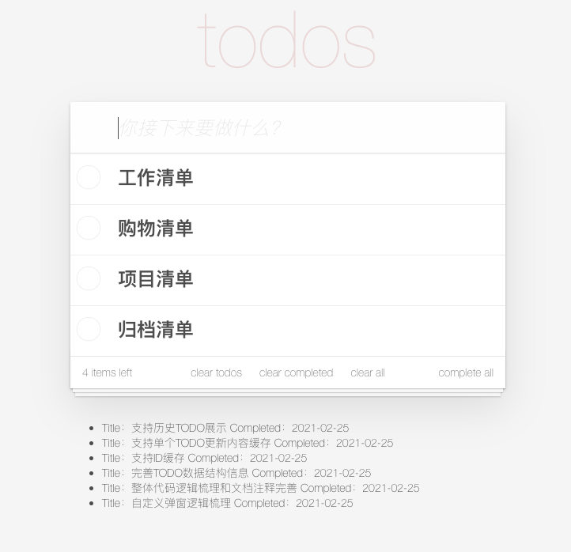

# Todo List App
一款基于 Vue 的非常简洁优雅的 ToDo List App，支持功能如下：
- 添加备忘；
- 双击更新备忘；
- 标记备忘完成；
- 删除备忘内容；



## 开发和部署
```
# 安装依赖
npm install

# 本地运行
npm run serve

# 部署打包
npm run build

# 代码检测
npm run lint

# 更多配置
查看配置文档：https://cli.vuejs.org/config/
```
